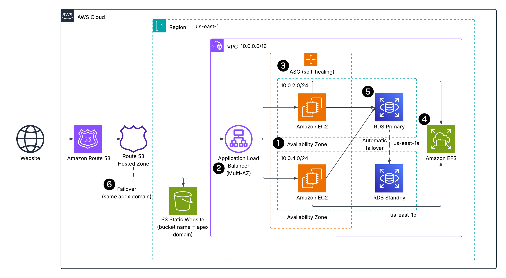
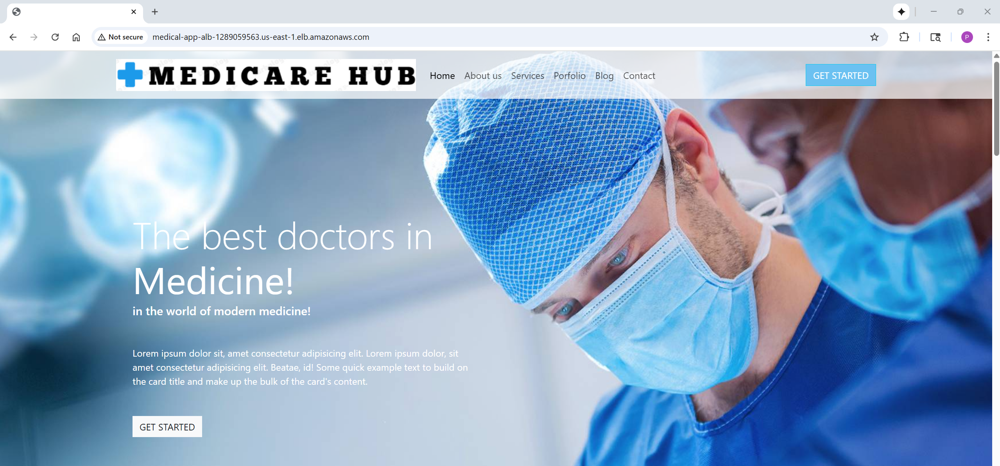

# Medicare Hub - Reliable Application Deployment on AWS (Reliability Pillar)  
A reliability-focused refactor of a deliberately fragile (“unreliable baseline”) app into a **highly available, self-healing** architecture using **AWS-native** services and **nested CloudFormation**.  

The app is intentionally simple (static website) so the repo can center on **reliability**: Multi-AZ design, ALB health checks, Auto Scaling self-healing, EFS shared storage, RDS Multi-AZ, and Route 53 apex failover to S3.  

## Architecture Overview  
  
*Figure 1: Medicare Hub - Reliability-Focused Architecture*  

### Legend (callouts)  
1. **Multi-AZ architecture** - ALB, EC2 (ASG), RDS, and EFS span **us-east-1a/1b** to survive an AZ outage.  
2. **ALB + health checks** - Routes traffic only to **healthy** instances; removes bad targets automatically.  
3. **Auto Scaling Group (self-healing)** - Unhealthy instances are **replaced automatically**; capacity maintained across AZs.  
4. **Amazon EFS (shared, regional storage)** - Web root on EFS so instances are stateless; replacements do not lose content.  
5. **RDS Multi-AZ** - **Synchronous standby** in another AZ with **automatic failover**; storage autoscaling reduces “out-of-space” risk.  
6. **Route 53 apex failover → S3** - If ALB/targets are down, the **same domain** serves a static S3 site for **graceful degradation**.  

> **Solid** arrows = primary data path; **dashed** arrows = failover path (Route 53 → S3 website).  

> The repo also includes an **unreliable baseline** template *(optional)* so you can contrast anti-patterns vs. the **reliable** design.  

## Skills Applied  
- Designing AWS reliability architecture **(Multi-AZ, health checks, auto-healing, graceful degradation)**.  
- Orchestrating infrastructure with **CloudFormation** (nested stacks, S3-hosted template URLs).  
- Administering access via **SSM Session Manager** (no public SSH).  
- Implementing **least-privilege IAM** for EC2 (bucket-scoped read-only).  
- Troubleshooting **ALB/TG** health and **Route 53** DNS failover behavior.  

## Features (reliability-centric)  
- **Self-healing compute:** Launch Template + ASG across two AZs; instances auto-replace on failure.  
- **Health-based routing:** ALB target group health determines traffic flow.  
- **Shared storage:** **EFS** backs the web root so any instance can serve identical content.  
- **Durable data:** **RDS Multi-AZ** with automatic failover and storage autoscaling.  
- **DNS resiliency:** **Route 53 PRIMARY** (ALB) / **SECONDARY** (S3 website endpoint) uses the **same apex domain**.  

## Tech Stack  
- **AWS Services:** VPC, IGW, NAT Gateway, EC2, Launch Templates, ALB, Target Groups, Auto Scaling, EFS, RDS (MySQL Multi-AZ), Route 53, S3, IAM, SSM  
- **IaC:** AWS CloudFormation (nested stacks)  
- **Other:** AWS CLI, PowerShell (examples)  

## Deployment Instructions  
> **Note:** Many commands are identical across shells; the main differences are line continuation (PowerShell: `` ` `` • Bash: `\` • cmd.exe: `^`), environment variables (PowerShell: `$env:NAME=...` • Bash: `NAME=...` • cmd.exe: `set NAME=...`), and path separators.  

### CloudFormation  
1. Clone this repository.  

2. Deploy the `s3-buckets.yaml` template to create S3 buckets (artifacts, content, and failover). The `FailoverBucketName` needs to match **exactly** to the apex domain to use the **Static website hosting** enabled for the DNS failover.  
    ```powershell
    cd cloudformation
    aws cloudformation deploy `
    --stack-name medicare-hub-s3-buckets `
    --template-file s3-bucket.yaml `
    --parameter-overrides `
      WebsiteContentBucketName=<your-bucket-name> `
      FailoverBucketName=<your-domain-name> `
      ArtifactsBucketName="<optional-bucket-name>" `
    --capabilities CAPABILITY_NAMED_IAM `
    --tags Project=aws-medicare-hub-reliability-pillar
    ```

    Grab the bucket names:  
    ```powershell
    $ARTIFACTS_BUCKET = (aws cloudformation describe-stacks --stack-name medicare-hub-s3-buckets |
    ConvertFrom-Json).Stacks[0].Outputs |
    ? { $_.OutputKey -eq 'ArtifactsBucketName' } |
    % { $_.OutputValue }
	
    $WEBSITE_BUCKET = (aws cloudformation describe-stacks --stack-name medicare-hub-s3-buckets |
    ConvertFrom-Json).Stacks[0].Outputs |
    ? { $_.OutputKey -eq 'WebsiteContentBucketName' } |
    % { $_.OutputValue }
	
    $FAILOVER_BUCKET = (aws cloudformation describe-stacks --stack-name medicare-hub-s3-buckets |
    ConvertFrom-Json).Stacks[0].Outputs |
    ? { $_.OutputKey -eq 'FailoverBucketName' } |
    % { $_.OutputValue }
    ```

3. Upload website content to the S3 buckets. The ASG Launch Template syncs from the **content bucket root** to the EFS-backed `/var/www/html`. Ensure `index.html` is in the **root**.  
    ```powershell
    cd ../MedicareHubWebsite
    aws s3 cp . s3://$WEBSITE_BUCKET/ --recursive
    aws s3 cp . s3://$FAILOVER_BUCKET/ --recursive
	  ```

4. Upload the nested CloudFormation templates to the S3 bucket:   
	  ```powershell
   cd ../cloudformation
   aws s3 cp phase1-networking.yaml       s3://$TEMPL_BUCKET/cfn/
   aws s3 cp phase2-efs.yaml              s3://$TEMPL_BUCKET/cfn/
   aws s3 cp phase3-rds.yaml              s3://$TEMPL_BUCKET/cfn/
   aws s3 cp phase4-compute.yaml          s3://$TEMPL_BUCKET/cfn/
   aws s3 cp phase5-dns-failover.yaml     s3://$TEMPL_BUCKET/cfn/
	```

5. Edit the `params.json` and `parent-template.yaml` file to customize the deployment.  
   - `KeyPairName` is an optional parameter to set the SSH key pair that will be used to SSH to the application servers for any additional configuration or troubleshooting. This can be created separately in the AWS Management Console under EC2 > Key Pairs.  
   - `DbUsername` and `DbPassword` are the credentials that will be used to access the RDS instance.  
   - `Phase*TemplateURL` is the Object URL of each nested template (e.g., https://<YOUR_BUCKET_NAME>.s3.<YOUR_REGION>.amazonaws.com/cfn/phase1-networking.yaml).  
   - The `WebsiteContentBucketName` and `FailoverBucketName` can be retreived from the outputs of the `s3-buckets.yaml` file. The `DomainName` must match the `FailoverBucketName`.  
   - The default values for `VpcCidr`, `PublicSubnet1Cidr`, `PublicSubnet2Cidr`, `PrivateSubnet1Cidr`, and `PrivateSubnet2Cidr`can be edited in the `phase1-networking.yaml` file.  

6. Deploy the CloudFormation stack:  
    ```powershell
    aws cloudformation deploy `
    --stack-name medicare-hub-parent `
    --template-file parent-template.yaml `
    --parameter-overrides file://params.json `
    --capabilities CAPABILITY_NAMED_IAM `
    --tags Project=aws-medicare-hub-reliability-pillar
	  ```

7. *(Optional)* The repo includes `unreliable-baseline.yaml` that demonstrates common anti-patterns (single public EC2 with 22/80 open, no backup or failover for website). Deploy separately if you want to compare behaviors; it’s not referenced by the parent template. Check `unreliable-baseline.yaml` for the exact parameter names and adjust if needed. Create the SSM SecureString parameter `/medicarehub-unreliable/db/master_password` to deploy.  
    ```powershell
    aws cloudformation deploy `
    --stack-name medicare-hub-baseline `
    --template-file unreliable-baseline.yaml `
    --parameter-overrides WebsiteContentBucketName=<your-bucket-name> `
    --capabilities CAPABILITY_NAMED_IAM `
    --tags Project=aws-medicare-hub-reliability-pillar-unreliable-baseline
	  ```
	
> **Note**: Ensure the AWS CLI user (`aws configure`) or CloudFormation assumed role has sufficient permissions to manage **S3**, **EC2**, **RDS**, **EFS**, **Route 53**, **SSM**, **VPCs**, **Subnets**, **Route Tables**, **NAT Gateways**, **IGW**, **ALB**, **Launch Templates**, **Auto Scaling Groups** **Security Groups**, and **IAM resources**.  

## How to Use (Validate Reliability Behaviors)  
1. **Deploy the infrastructure** using CloudFormation and collect outputs:  
    ```powershell
    $Region  = (aws configure get region); if (-not $Region) { $Region = 'us-east-1' }
    $Parent  = 'medicarehub-parent'   # your parent stack name
    $parentOut = (aws cloudformation describe-stacks --stack-name $Parent --region $Region | ConvertFrom-Json).Stacks[0].Outputs
    $AlbDNS    = ($parentOut | ? { $_.OutputKey -eq 'AlbDNSName' } | select -Expand OutputValue)
    $Domain    = "<Your-Domain-Name>"
    ```
	
2. **Normal path works (ALB → EC2 → EFS):**  
    ```powershell
    Invoke-WebRequest -Uri ("http://{0}" -f $AlbDNS) -UseBasicParsing | Select-Object StatusCode
    Invoke-WebRequest -Uri ("http://{0}" -f $Domain) -UseBasicParsing | Select-Object StatusCode
    ```
	
3. **Auto Scaling Group self-healing:**  
    ```powershell
    $phase4Id = (aws cloudformation describe-stack-resources --stack-name $Parent --region $Region | ConvertFrom-Json).StackResources |
    ? { $_.LogicalResourceId -eq 'Phase4Compute' }
    | select -Expand PhysicalResourceId
    $phase4Out = (aws cloudformation describe-stacks --stack-name $phase4Id --region $Region | ConvertFrom-Json).Stacks[0].Outputs
    $TgArn   = ($phase4Out | ? { $_.OutputKey -eq 'TargetGroupArn' }        | select -Expand OutputValue)
    $AsgName = ($phase4Out | ? { $_.OutputKey -eq 'AutoScalingGroupName' }  | select -Expand OutputValue)
    "TG ARN : $TgArn"
    "ASG    : $AsgName"
	
    # Check target health- should see healthy targets.
    aws elbv2 describe-target-health --target-group-arn $TgArn --region $Region | ConvertFrom-Json | Select-Object -Expand TargetHealthDescriptions
    
    # List instances, terminate one at random (ASG replaces it)
    $inst = (aws autoscaling describe-auto-scaling-groups --auto-scaling-group-names $AsgName |
    ConvertFrom-Json).AutoScalingGroups[0].Instances
    $bad = Get-Random -InputObject ($inst | Select-Object -Expand InstanceId)
    aws autoscaling terminate-instance-in-auto-scaling-group `
    --instance-id $bad --should-decrement-desired-capacity $false | Out-Null
    ```

4. **DNS failover to S3 (apex):**  
    ```PowerShell
    # Scale to zero to force failover
    aws autoscaling update-auto-scaling-group --auto-scaling-group-name $AsgName --desired-capacity 0 --min-size 0 --region $Region
    
    # Wait ~5 minutes; ALB has no healthy targets
    $hz = ($parent.Stacks[0].Outputs | ? {$_.OutputKey -eq 'HostedZoneId'}).OutputValue
    
    # What Route 53 would answer right now?
    aws route53 test-dns-answer --hosted-zone-id $hz --record-name $Domain --record-type A | ConvertFrom-Json
    
    # The domain should now serve from S3 (Status Code 200).
    $r = Invoke-WebRequest -Uri ("http://{0}" -f $domain) -Method Head -UseBasicParsing
    $r.StatusCode, $r.Headers['Server']
    
    # Restore capacity to failback DNS to ALB. Wait ~5 minutes until ALB has 2 healthy targets.
    aws autoscaling update-auto-scaling-group --auto-scaling-group-name $AsgName --desired-capacity 2 --min-size 1 --region $Region
    
    # The domain should now serve from ALB/EC2 (Status Code 200).
    $r = Invoke-WebRequest -Uri ("http://{0}" -f $domain) -Method Head -UseBasicParsing
    $r.StatusCode, $r.Headers['Server']	
    ```

## Project Structure  
```plaintext
aws-medicare-hub-reliability-pillar
├── assets/                               # Images, diagrams, screenshots
│   ├── architecture-diagram.png          # Project architecture diagram
│   └── application-screenshot.png        # Minimal application screenshot
├── cloudformation/                       # CloudFormation templates
│   ├── parent-template.yaml              # Wires phases (nested stacks from S3 URLs)
│   ├── phase1-networking.yaml            # # VPC, subnets, IGW, NAT
│   ├── phase2-efs.yaml	                  # EFS + mount targets, SG (NFS 2049 from app SG)
│   ├── phase3-rds.yaml                   # RDS MySQL Multi-AZ, private subnets, SG from app SG
│   ├── phase4-compute.yaml               # LT + ASG + ALB + TG health; UserData mounts EFS, syncs S3
│   ├── phase5-dns-failover.yaml          # Route 53 zone; PRIMARY→ALB, SECONDARY→S3 website endpoint
│   ├── s3-buckets.yaml                   # Artifacts bucket, content bucket, failover bucket (+ policy)
│   ├── params.json                       # Parent parameters (Template URLs + minimal inputs)
│   └── unreliable-baseline.yaml          # Optional unreliable stack (not referenced by parent)
├── MedicareHubWebsite/                   # Website files
│   ├── img/                           	  # Images
│   ├── index.html                        # Default web page
│   └── styles.css                        # Stylesheets
├── LICENSE                               
├── README.md                             
└── .gitignore                            
```

## Screenshot  
  
*Figure 2: Minimal application page served via ALB (primary) and S3 (failover).*  

## Future Enhancements  
- **CloudWatch alarms** for ALB 5xx, TG unhealthy count, ASG term/launch, EFS burst credits, RDS failover events.  
- **Second NAT Gateway** in the other AZ for full egress resilience.  
- **CloudFront** in front of S3 failover for HTTPS and caching.  
- **Secrets Management** using AWS Secrets Manager instead of parameter values for DB credentials.  
- **CI/CD (GitHub Actions)** to lint/validate CFN and deploy stacks.  
- **Cross-Region DR** *(optional advanced)*: second region + Route 53 latency/failover routing.  

## License  
This project is licensed under the [MIT License](LICENSE).  

---

## Author  
**Patrick Heese**  
Cloud Administrator | Aspiring Cloud Engineer/Architect  
[LinkedIn Profile](https://www.linkedin.com/in/patrick-heese/) | [GitHub Profile](https://github.com/patrick-heese)  

## Acknowledgments  
This project was inspired by a course from [techwithlucy](https://github.com/techwithlucy).  
The Medicare Hub static website files were taken directly from the course author's original implementation.  
The architecture diagram included here is my own version, adapted from the original course diagram.  
I designed and developed all Infrastructure as Code (CloudFormation) and project documentation.  
